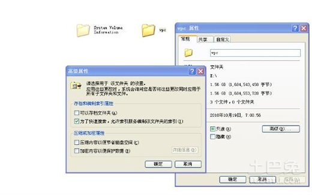
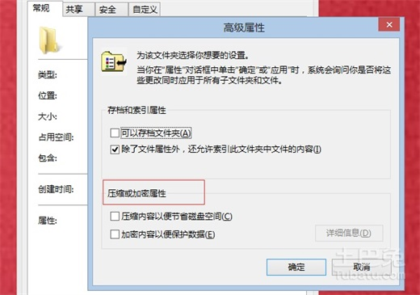
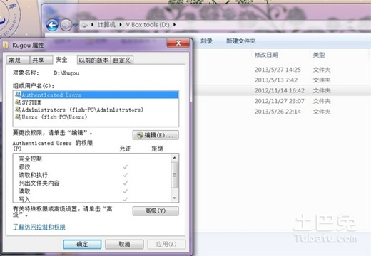
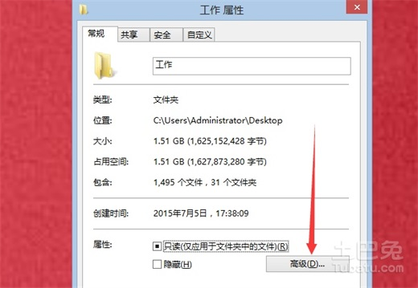

# 怎么给文件夹设置密码，两种方法轻松搞定

|在二十一世纪，许多人都将用电脑来完成自己的工作、学业等问题，而在使用电脑的过程中，需要创建一个又一个的文件，每一个文件里的内容都是非常重要的。有时候在嘈杂的工作中，我们必须要离开电脑完善自己的事情，又恐怕电脑内的文件被其它人窃取而去，这个时候就需要学会如何给文件夹设置一个新的密码，以保证自己不丢失任何的宝贵文件。 　　**工具：**　　电脑，笔记本与台式电脑均可  　　**方法一步骤：**　　1、您的文件夹最好存放于D盘，这样不容易丢失。 　　2、选择一个您想要加上密码的文件夹，用[鼠标](http://www.dngsw.cn/dnwx/moukey/)，轻轻点击右键，点击“属性”这个时候，电脑桌面会出现一个对话框，这个对话框的名称为“新建文件夹属性”，它的右下方有个“高级”的按钮。 　　3、您会看到一个“加缩或加密”的属性，这个时候，您点击属性中的“加密内容”这个选项。之后，这个文件就可以进行加密处理了。加密之后，您的保密文件的名字将会变成深蓝色。输入密码，加密完成。  　　**方法二步骤：**　　1、第二种方法与第一种不同，它的安全性更高，因此，许多用户都喜欢用第二种方法加密。这个加密方法，同样非常的简单。首先，我们在需要加密的文件上，点击右键，选择“压缩文件A”这种字样，之后，与第一种方法相同。 　　2、点击“高级”，右方有“设置密码”的按钮，您只需要在弹出来的文件框内，写上您的密码，这个步骤就进行完毕了。  　　3、完成了文件的加密，这个时候，您可以将文件隐藏起来，这样，别人即便有意破解您对文件密码，也不知道文件存储的真正位置，这样，将更加便于您对文件的保护。 　　**温馨提示：**    以上两种方法都是加密方法，不同的是一个进行压缩，而一个没有。不过第二种方法对文件的保护也具有严密性的效果。  　　以上就是给文件夹设置密码的全部步骤，学习了这些，也千万不要大意。文件夹的密码虽然说难以破解，但如果您在解密的时候被别有用心的人看到，还是不妥的。建议经常更换文件夹的密码，同时也建议您给自己的文件夹留一个备份，以防别人打不开而删除您的宝贵文件。温馨提醒哦，在设置密码后最好牢记密码于心，如果您连密码都忘记了，那可就智能找电脑专家来帮您解开电脑文件的密码了。|
| ----- |