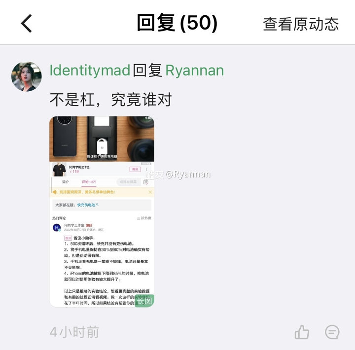
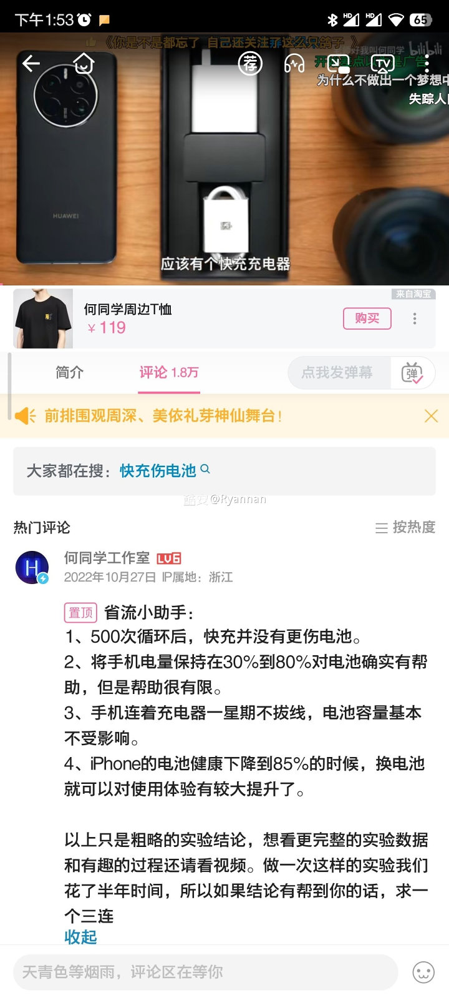

# 锂电池养护保护详解——何同学视频错漏补充 来自 Ryannan - 酷安
【收藏可以，请不要截图外传，我不想和何粉丝辩】
因为有个酷友问了这个事情，刚好这个话题我之前就了解研究过了，不吐不快。
把它拆解开来细细讲讲，全文xxxx字，阅读时间三分钟，能帮助大家了解锂电池的一些深入知识。
【开篇叠甲】
【请不要说“麻烦不如换电池”之类的话，这是一篇研究科普文。】
【请不要说“麻烦不如换电池”之类的话，这是一篇研究科普文。】
【请不要说“麻烦不如换电池”之类的话，这是一篇研究科普文。】
【想KY的同志，推荐掏钱帮酷友们把电动汽车锂电池给换了。】

1.“快充并没有更伤电池”
这点我目前相信他的数据。
起码在1C的范围内是大致没问题的。但在高于1C的基础上越快就越伤，具体可以看论文\[3\]。（1C是锂电池研究中的术语，具体是什么含义可以去百度。）
他的这结论我反正挺高兴的，差距并不大。我也挺喜欢十分钟满电的手机，换电池也不贵。
不过不懂那些用10分钟满电的xdm为什么经常说电池损耗很快，可能是先入为主这么觉得了吧，我更愿意相信数据一点。
------------分割线------------  

2.“保持30%到80%帮助有限。”
这个是错误的。
实际上你看他自己的测试数据仔细一点就会发现，在他视频04：04，对比数据就会知道。
这两组的差异已经大到了足足有50%（（12-8）/8））的级别了。
这是“显著差异”而不是“帮助有限”。
他不过是为了输出自己的观点，通过煽动的话术让你觉得，噢百分之四嘛没多少。
实际上在研究过程中50%的差异十分巨大，这意味着当别人剩70%健康度的时候，你还有80%，续航能差四五十分钟。
往大了看，电动汽车的锂电池放电深度也早有人做相关研究了，可以看看：特斯拉电池系统不同放电深度/循环寿命测量 的报告，观点也很明确，和我说的一致。开过电动汽车的人自然会了解这些，车主大多也不会说出“买来就是来用的随便造造完了换块电池。”之类的话。
并且在实际研究结果中，放电深度也对使用寿命有影响。
实际上如果把范围调整成80%-20%或者80%-10%进行一千次循环，损耗还可以做到更低（仅限于手机电池，因为手机锂电池截止电压远小于关机电压）。
这些早有人研究并做过完整实验了\[4\]。
------------分割线------------  

3.“手机插一星期线对电池没有影响”
他这个实验的问题很明显：时间长度一周。
如此短的时间长度，搞噱头而已，全世界的厂商都明白的告诉我们高电压对电池不好，恒压充电也对电池不好，一堆实验早就证明这个事情了\[3\]。
例1：你正常拿到刚出厂的新机没有一个是满电的。除了防止满电电池易燃以外，另一个考虑因素就是高电压仓库存放后，重新充满电后电池会损耗偏多。
例2：这几年几乎所有厂商都给手机加上了“夜间充电优化”功能，三星甚至原生自带可以限制充电到80%停止，该不会有人觉得自己比造手机的懂吧。
例3：大疆，人造卫星，电动汽车，这三样随便去了解一下他们的锂电池设计和使用推荐即可。
------------分割线------------  

4.“85%以下换电池。”赞同，没问题。电池便宜的一百多的不用想那么多，一年一换就好了。
------------分割线------------  

5\. 他没提的我简单提一嘴，发热对锂电池影响是更大的，所以充电和打游戏注意温度帮助会很明显。开电动汽车的平时也最好停树荫底下（汽油车其实一般我们也停树荫下。）
------------分割线------------  

实际操作建议
【想爱惜电池的可以做，不想做可以不做，请勿发表KY评论】
1. 充电到80%，用到10%。
2. 充电和游戏的时候注意温度。
3. 不要晚上插电到早上满电。  

参考资料出处：
\[1\] [查看链接](https://www.researchgate.net/publication/229375371_Study_of_life_evaluation_methods_for_Li-ion_batteries_for_backup_applications "https://www.researchgate.net/publication/229375371_Study_of_life_evaluation_methods_for_Li-ion_batteries_for_backup_applications")
\[2\] Xu, B., Oudalov, A., Ulbig, A., Andersson, G., & Kirschen, D. S. (2018). Modeling of Lithium-Ion Battery Degradation for Cell Life Assessment. IEEE Transactions on Smart Grid, 9(2), 1131-1140. doi:10.1109/tsg.2016.2578950
\[3\] Choi, S. S., & Lim, H. S. (2002). Factors that affect cycle-life and possible degradation mechanisms of a Li-ion cell based on LiCoO2. Journal of Power Sources, 111(1), 130-136. doi:10.1016/s0378-7753(02)00305-1
\[4\] Ning, G., & Popov, B. N. (2004). Cycle Life Modeling of Lithium-Ion Batteries. Journal of The Electrochemical Society,151(10). doi:10.1149/1.1787631  

夹带一张林俊杰的美照

