# 二手平台使用手册（手机篇）及亲身反面教材 来自 叶崽owo - 酷安
这里是叶崽owo，想分享一些多年行走二手江湖的宝贵经验。  

各位酷友闯荡于二手江湖，一定接触过\[二手物品\]这一类栏目，而咱们酷安的主要分享物品，就是数码板块物品。而二手数码产品便是绝大多数酷友玩机的渠道来源。  

\[二手物品\]为什么能够这么流行呢？原因是二手物品的性价比实在是太高了，相比较于一手新物品，9新二手物品有着一手物品的高品质，但是价格却是一手物品8折甚至更低，这就给了大家更加开阔的玩机空间。  

但 ＜人在江湖谁能不湿鞋？＞
\[二手物品\]也有许多需要注意的地方！接下来小叶将讲解一下二手平台的正确查找搜索物品，以及小叶自己一的个实际例子来反面教育大家。  

注意 : 本篇字符有点点多，耐心的酷友请认真看完，绝对不亏  

若本篇涉及侵权个人隐私问题，请及时联系小叶告知问题

以下以\[闲鱼\]软件示范为例，如图中有违规侵权请联系小叶  

1 : 如何搜索自己喜欢的物品  

小叶最近喜欢一款名为魅族17Pro的手机想来收藏，由于该手机已经没有了全新未拆封，于是小叶打开了闲鱼，搜索了魅族17Pro（如果对内存或者版本有需求，请在手机后面打一个空格，再打出内存，例如\[魅族17Pro 128\]，\[魅族17Pro 白\]，\[魅族17Pro 12+256\]，\[魅族17Pro 国行\]）这样可以直接筛选掉大量你不需要的配置

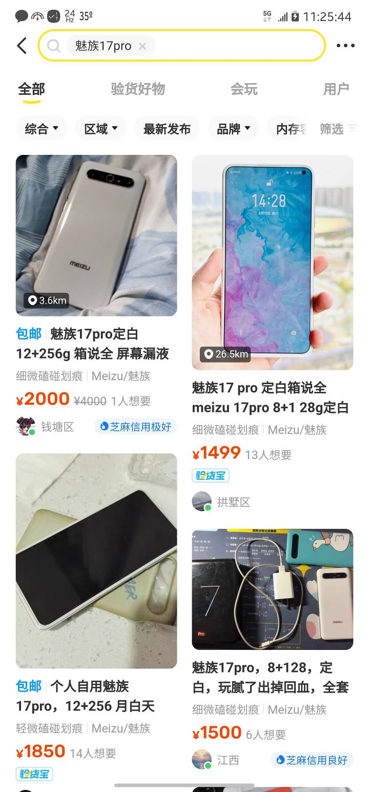

\[重点\] 2 : 如何挑选物品  

这一步骤是最重要的！  

首先，点击右边筛选，选择\[一天内\]或者\[三天内\]的发布时间，筛选掉大部分僵尸帖，更加精准的搜索到真正可以买到的物品

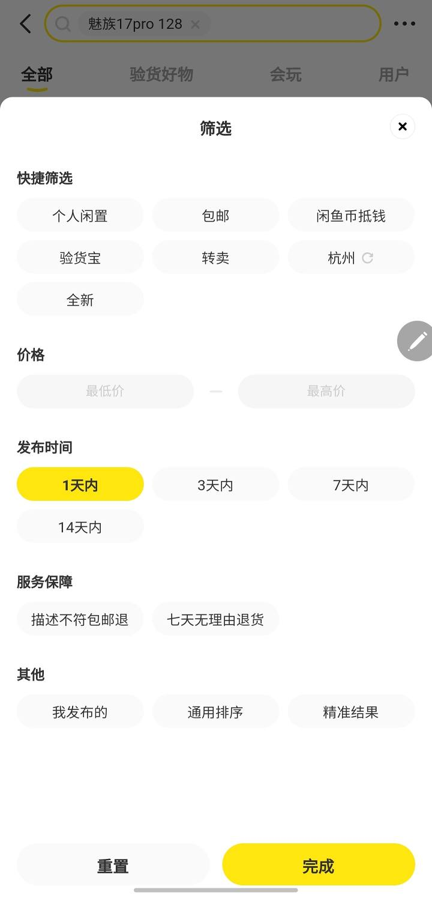

然后，接下来就是要查看这个物品的大致价格，我搜索出来后，发现功能完整的魅族17Pro 128G的价格大概在1200-1800上下，那这时候，我们可以尝试着根据自己预算压一下价格，再次点开筛选进行压价

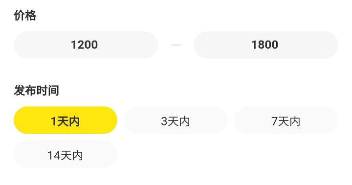

压价以后，我们可以发现搜索的范围更加精确  

看帖子时，注意查看浏览量和想要量，如果浏览量大于1000，想要量大于20人，说吗这个帖子有可能是个不卖的僵尸帖，或者卖家没有心思卖出物品。  

然后，我们需要对卖家进行鉴别。  

先看卖家的信用等级，如果是信用极好或者是信用优秀，那么代表这个卖家相对可靠，可以选择找他购买。如果卖家是信用极差或者信用中等，说明这类人不是那么可靠（当然不排除某些信用中等的人群是因为支付宝用得少，但也要谨慎）

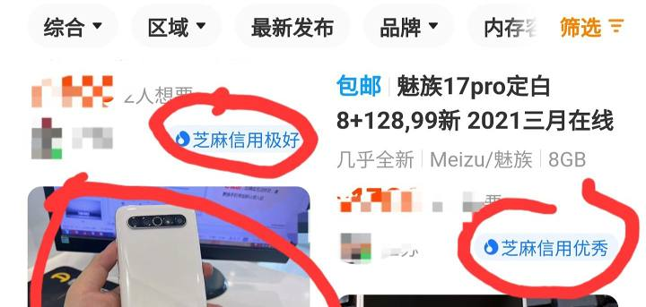

接下来，我们改挑选适合自己橙色的手机了，例如小叶喜欢外观9成新无拆修并且是白色面板的的，那小叶就尽量找白色的，主页图干净的帖子，看到某些背景重复的帖子就可以跳过了

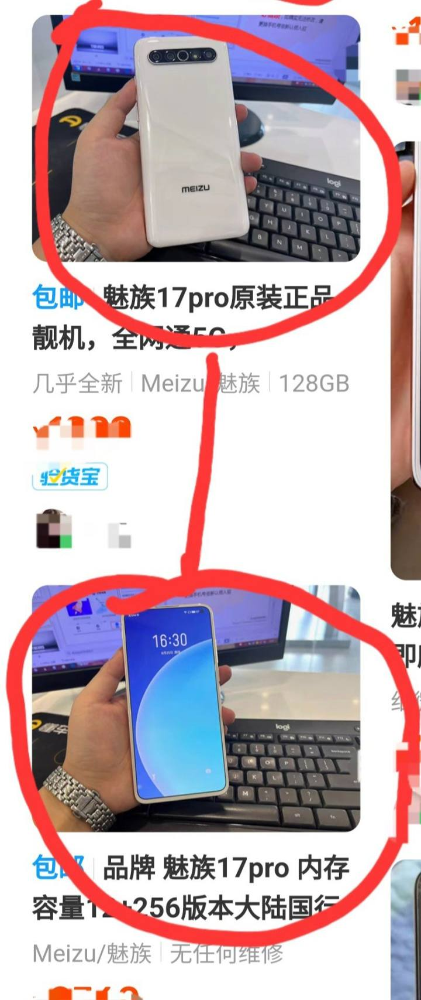

终于找到适合自己的手机，这时候我们要点开，仔细看商品的详情，有没有玩文字游戏，没有的话就开始看图片，眼见为实，必须是要你看清了，你才能确定这台机子的机况是什么，这里以一位卖家的主页为例（如有侵犯请联系小叶）

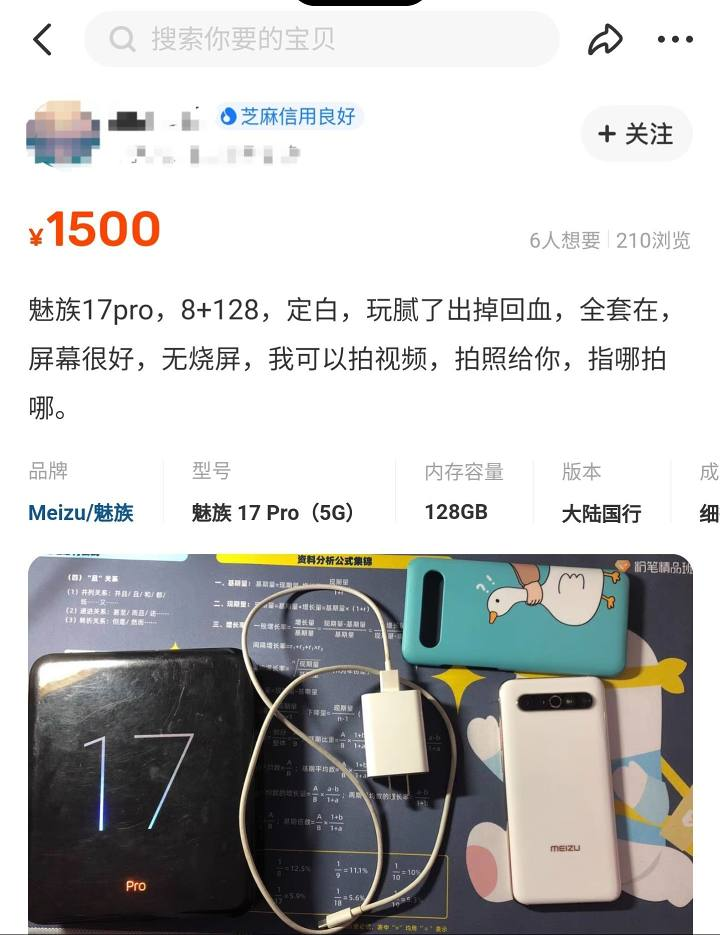

好的，机子没有什么问题，这个时候我们要再点开卖家主页，查看这个卖家到底是不是正常的卖家。  

\[重点\]！我们需要的是:  

个人卖家
信用号好
评价没有差评  

如果这个卖家买的东西类别很杂，说明这个卖家大概率是一个 个人卖家

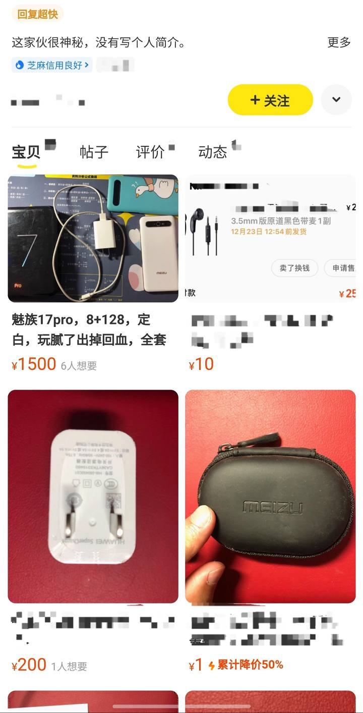

而\[商家\]专业贩子大部分都是卖同一类物品，例如全是手机

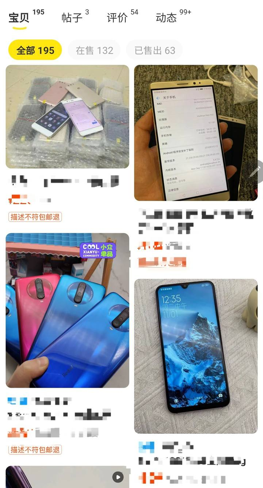

打开他的评价，看一下他的过往交易人对她是什么印象，有没有什么不好的地方，例如性格，或者是信用

好，确定都没问题，那可以准备跟卖家聊聊砍砍价下单了，再次问清楚配置信息和保修，配件之类信息。记得找卖家要发货前视频，留作备份证据（下图为小叶购买的zflip3记录）

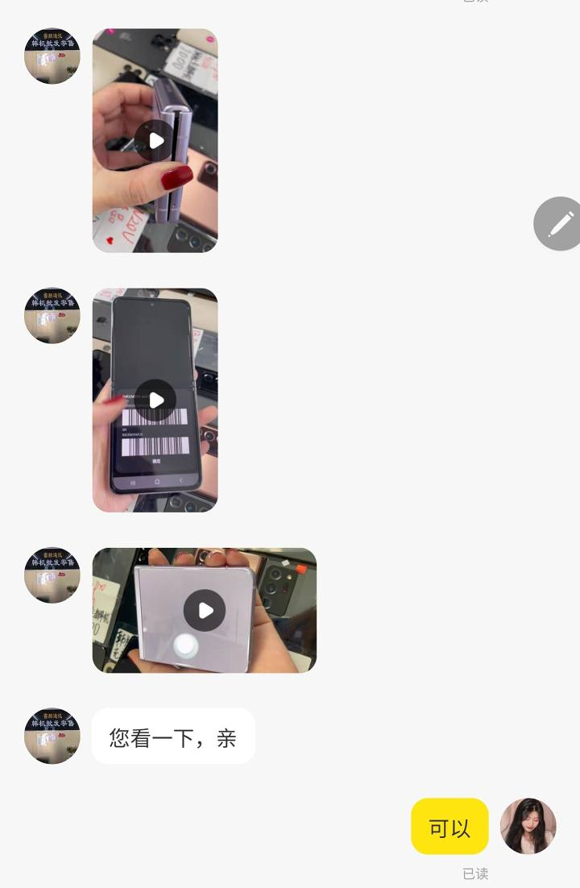

然后坐等收货……  

3 : 检查物品  

快递到手，马上打开视频录制开箱过程，并且要把手机的IMEI也拍下记录，证明这是和卖家所提供IMEI相符的一台手机

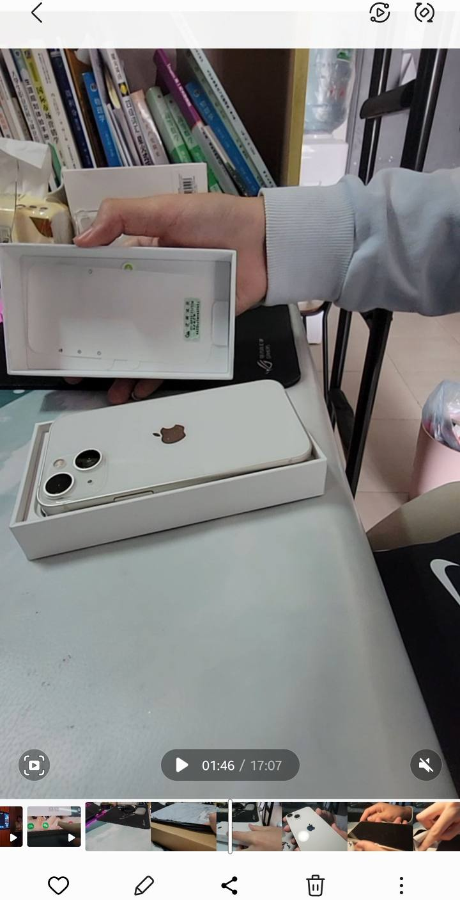

接下来就是检查外观，查看功能是否正常可用，各个品牌都有自己的检测方式，如小米拨号\*#\*#64663#\*#\*，三星则是在盖乐世社区检测  

最后，使用1天左右，体会电池是否耐用，其他隐藏暗病有没有显露，如果没有的话，一般情况是安全下车了！  

OK！接下来是小叶亲身经历的一个反面例子！  

2022年10月，小叶在某转平台上购买了一台三星zflip3

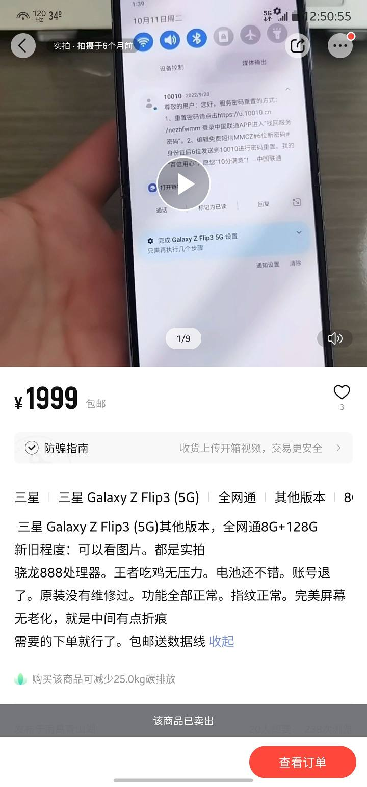

我发现图中手机折痕处有类似疏油层脱落问题，询问卖家，卖家说手机上有贴膜，是手机膜的疏油层脱落
在多次询问卖家机况后，卖家发给我一个有些许模糊的视频，小叶想想可能是光线问题并没有过多追问

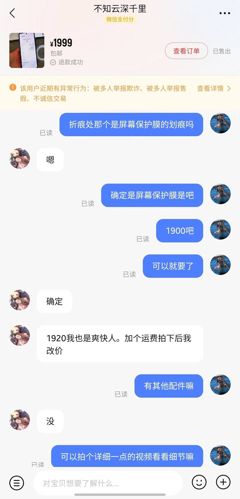

过了几天，手机到了，小叶立马做开箱视频进行证据录制，并且录制了手机的IMEI，和卖家提供的一致

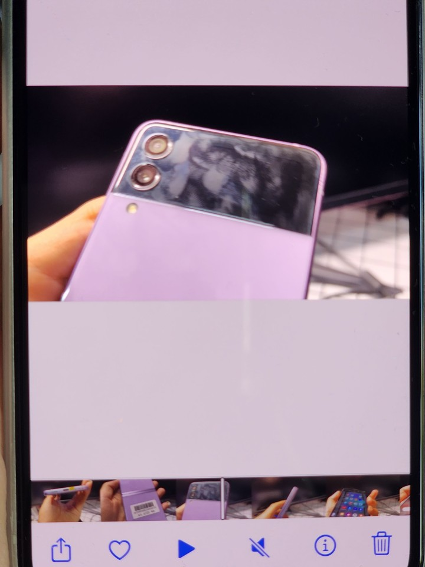

果不其然，折痕上的疏油层就是手机屏幕的疏油层，卖家的手机根本就没有贴膜！于是小叶立刻去找卖家理论，结果卖家咬死断定手机上面就是贴了膜的，并且拒不退货

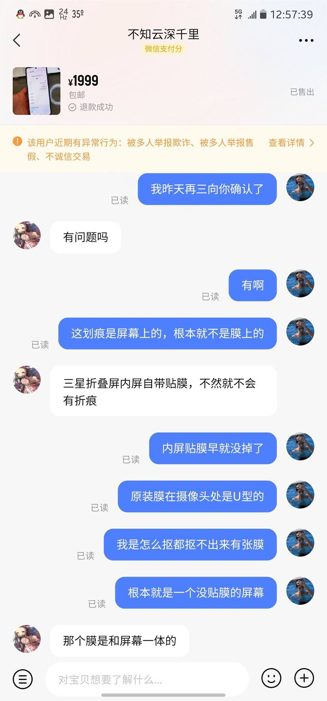

小叶不想跟他多解释，直接走\[小法庭\]  

这里小叶跟大家分享一下走小法庭的经验:  

1 : 条里一定要清晰，一定要抓住卖家的漏洞，死死抓住漏洞来一一说明
2 : 句子要书面化，并且需要有一定的依据，可以利用百度搜索出问题的相关详情，可以让判官们更好的了解问题的严重性
3 : 小法庭反驳次数是有限的，字数也是有限的，所以要尽量简洁明了，不要有赘余  

小叶开始与卖家走\[小法庭\]
以下是小法庭记录（请从下往上看）

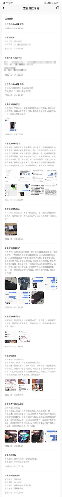

酷友们可以发现，小叶的反驳非常的有条理，由于有些判官对一些手机的特殊功能不了解，小叶特意去百度截图资料并且询问机主确认，让判官们学习了解这个知识，从而判定此次交易谁对谁错。而卖家就仅仅只是说了几句气话，没有一点条理，本身自己就理亏了，还不在文字上多动动笔，输了是必然的。最终，小叶胜利，并且还报销了运费。还有！寄出去的时候也要拍一个封箱视频，作为封箱闭环取证。  

好了，总结一下这篇文章

  

首先，学会利用筛选来挑选物品
其次，查看卖家是否可靠的条件是:个人卖家，信用号好，评价没有差评
然后，收到物品一定要做好开箱视频，退回物品一定要做封箱视频，视频内容一定要展示机器所有功能和IMEI！
最后，通过平台进行交易，绝对不要私下交易！  

二手平台使用手册就此结束！感谢大家耐心看完！如果你遇到类似情况，可以向小叶提问，小叶会给你一个可靠的参考！

[#三星GalaxyS23Ultra#](https://www.coolapk.com/t/三星GalaxyS23Ultra?type=12) [#小米13#](https://www.coolapk.com/t/小米13?type=12) [#iPhone14ProMax#](https://www.coolapk.com/t/iPhone14ProMax?type=12)