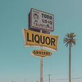
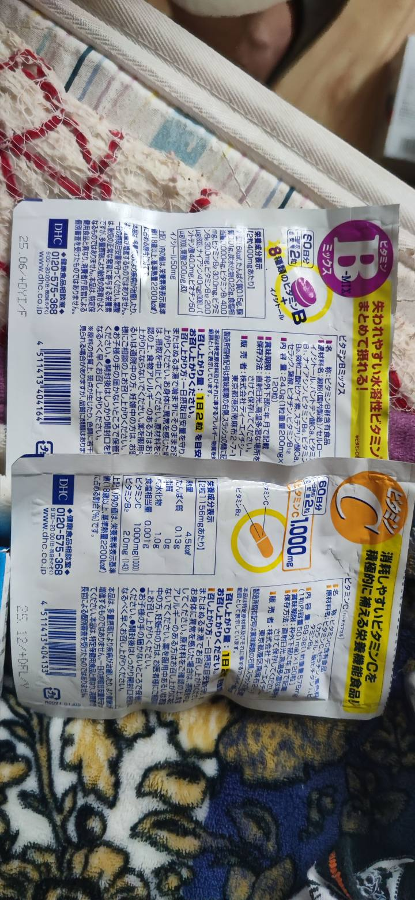
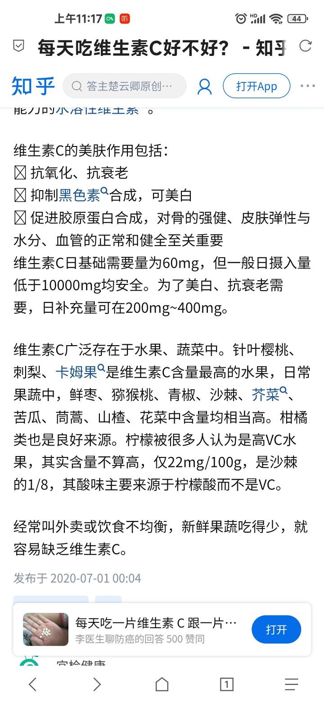
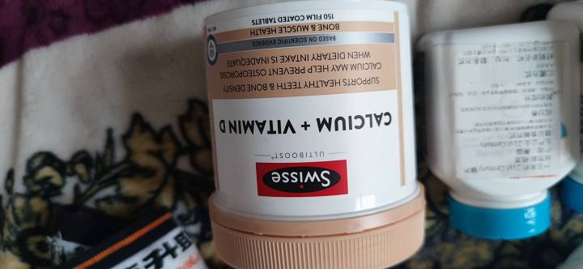
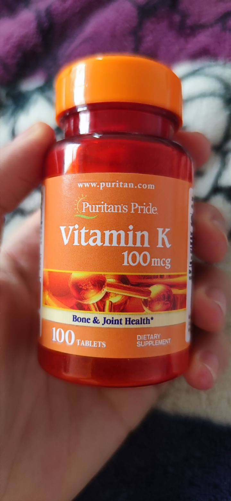
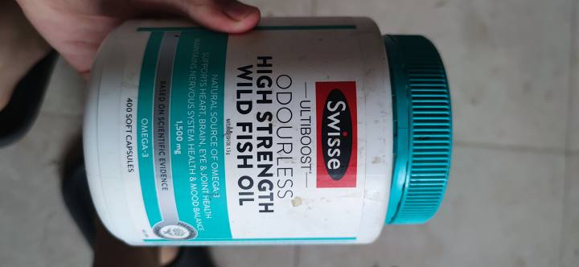
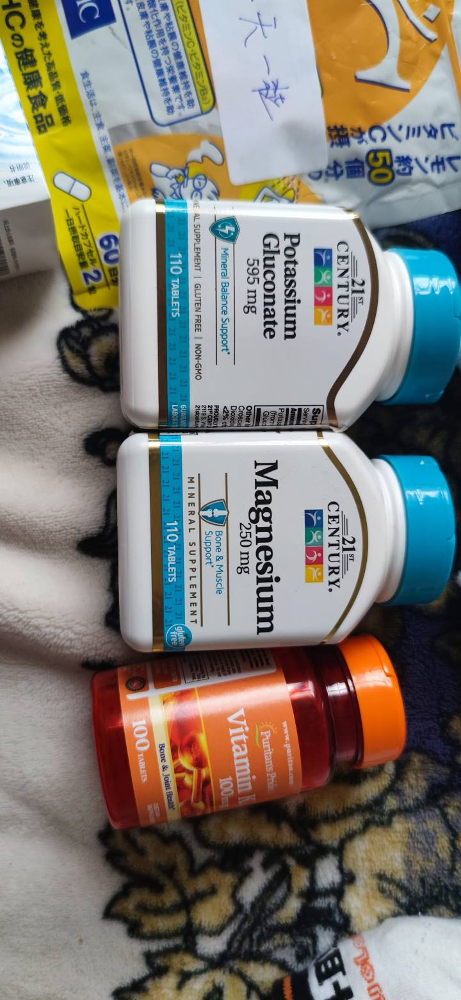
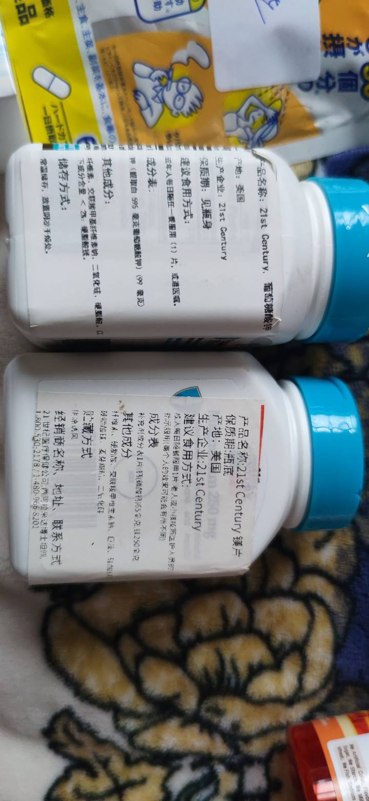
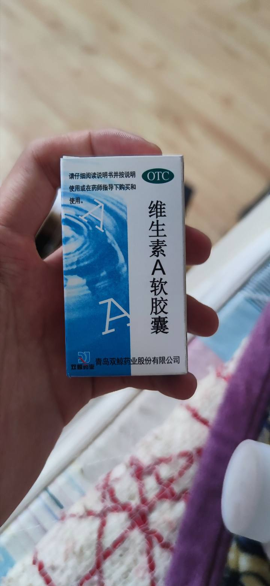
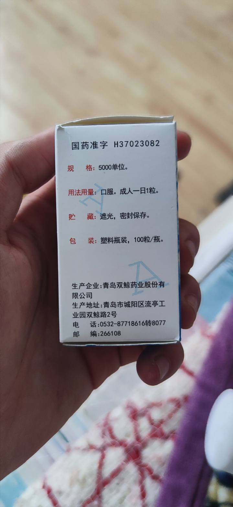

# 保健品这一大坑 来自 FondSycAndXry - 酷安

保健品这一大坑

FondSycAndXry

1个星期前 小米10

关注

首先，我没有接广告，我也不是医学专业，只是从一个消费者和对商品是否有益的情况下评判的
维生素c跟维生素b我推荐DHC的，日本进口，大概一包在20到40元不等，价格比较便宜，60天份的

维生素c大概是每粒500mg
维生素b大概是200mg

隔一天一粒对身体最没有影响，不过也不能盲目的去补充维生素  

补钙的话最好搭配维生素d和维生素k

这个牌子大概了解一下保健品的都知道，斯维诗
这个一瓶大概99左右，整体含量和效果也比很多品牌好很多
我给父母也是买他们家的深海鱼油，父亲血管不太好，吃这个好很多，目前年纪也大了，这个对保护血管有很大作用

这么大一罐，保质期五年，可以吃很久，大概一百接近两百左右

这个是钾片跟镁片，这个倒是便宜，大概一罐在40到50左右，一天一片即可

最后就是维生素a了，我是在没找到合适的替代品，找到国内带OTC的，也是非常不错的
这是我目前在用的保健品  

没有广告，我不推荐国内的，除了OTC，为什么不推荐呢？
他们东西本来就不太行，而且还买的那么贵，这是最主要的，我可以花同样的价格获得更好的服务，我为什么不去选择更好的呢？
[@酷安小编](https://www.coolapk.com/u/酷安小编)  

[#酷安夜话#](https://www.coolapk.com/t/酷安夜话?type=12)

462

341

326