# 如何在咸鱼遨游而不翻车？ 来自 难道你是谁的dog - 酷安

如何在咸鱼遨游而不翻车？

难道你是谁的dog

2个星期前 OPPO K10

经历过的事情才会有感触  

为什么会有这么一篇防止在咸鱼翻车的文章？  

从动态中可以看出楼主我，在前几天发布的一台二手交易，vivo z5x由于之前换过屏幕，并且外观也是伊拉克那种，于是便想着低价赶紧出手，最终呢和酷安老哥278的价格交易，今天也是到货了。  

原本我是觉得，发货之前手机的什么情况都测试好了，老哥应该很快就会收货，谁想到他一连串发了一些屏幕的问题

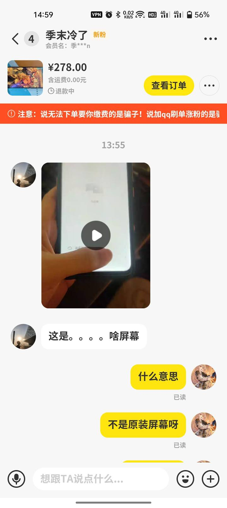

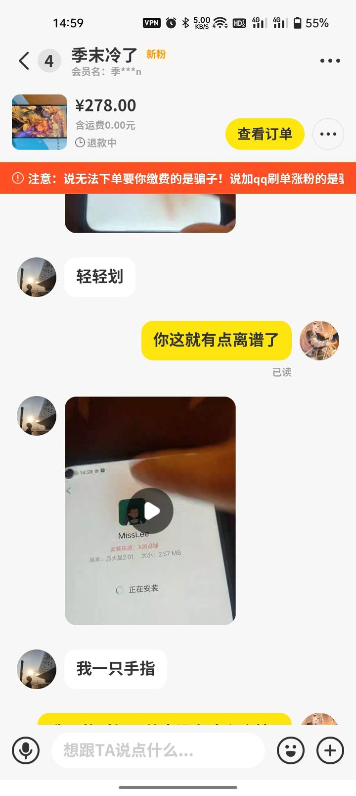

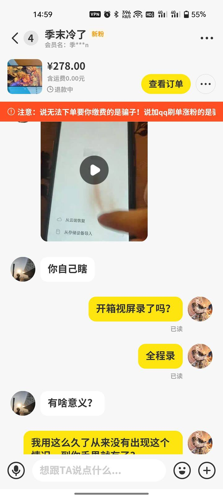

当时，就是感觉很离谱，用了这么久的机子，怎么到他手里就变成这样了呢？酷友们天天玩咸鱼第一反应就是肯定遇到骗子了，我也这么认为啊，直接开始扯了起来，总之各有各的理

，这老哥最后也是直接拉黑我了  

基本流程就是走咸鱼法庭呀，奈何半天时间了，小二老是不来，我不喜欢扯皮的，仔细想了一下200快的东西，贩子好像不值得和我扯皮吧？于是我晚上就做出了让步

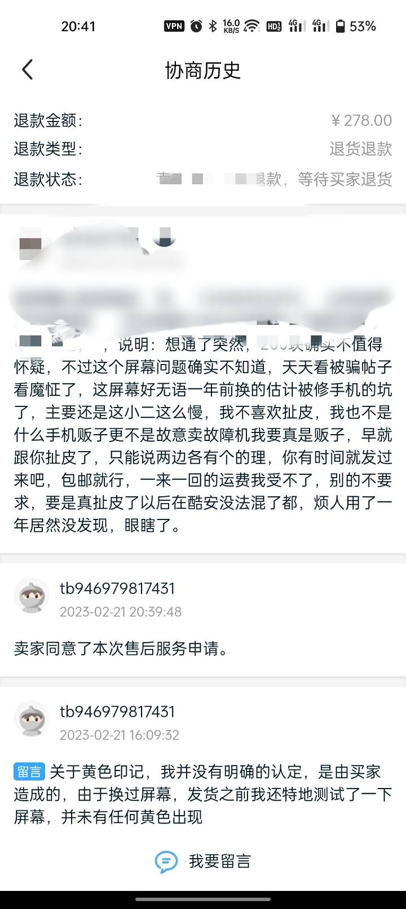

当然，这只是我今天的经历，当时气的我直接气死我了  

本人也是一个小咸鱼卖家

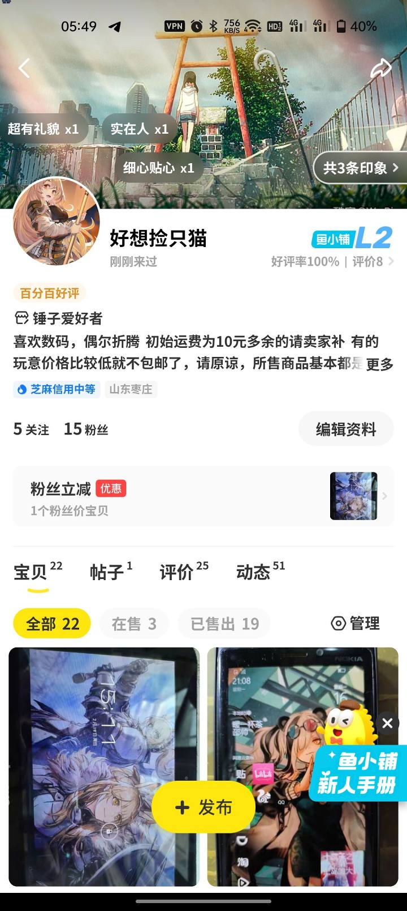

我主要就是倒手卖，看到便宜的也就买下来，做个摸摸党，玩够了在卖出去

下面给大家总结一下，我如何降低翻车的经历的
买电子垃圾
1.你要是想买一个二手机的话，先不要去咸鱼看价格，来酷安的二手交易看，咸鱼个人卖家很少的，基本都是贩子，极少部分是鸽王（这类人群卖是真卖，但是由于工作原因或者乱七八糟啊的原因，经常不在线，或者老是忘记，你得催催他）
2.贩子的价格比普通的都要高的，一般简介或者手机，较为明显的地方都会有编号或者标记,或者从商户名字中就可以看出来（xxx工作室。xxx二手店。xxx维修），贩子大多数是真货，只不过有的确实坑，因为有的价格高的离谱，所以我不建议捡贩子的垃圾
3.当你相中了一台电子垃圾，首先你得看清楚简介的，有的js（奸商）很坏，跟你玩文字游戏和扣字眼，当然图片要是看不清也得问商家要，他要是不给你就说：看不清，我的眼有点老花。
其次，进去问清楚型号以及内存组合，因为有的人糊涂或者故意的，他会把手机型号和内存标错从而误导你

最后，有啥问题都要问清，最好都是让商家给你拍视频看看（进过水没？摔过吗？因为什么原因不开机？之前修过吗？拆过机吗？换过配件吗？指纹能用吗？按键正常吗？摄像呢？WiFi？外放？通信？）他没说过的最好都问一遍，不要拿到手里之后发现不对，开始扯皮，没想到人家早就提桶跑路
4.到货之后，特别是一些声甜话美的商家，不要聊着聊着就来感情

，商家说得好啊，都检查了放心就是，到货直接收货完全没问题，记得好评，自己全部都测试一遍，真的没问题了再收货也不迟，实在不行把玩了一天  

卖电子垃圾
1.配置和型号都要标注准确，外观和细节或者缺陷的部分都要明确的标注或者拍出来，不包邮也要写出来，最好在开头，有些人眼睛是真瞎
2.卖东西最重要讲诚信，买家要问什么，最好一五一十的说出来，你不要指望二手能给你带来多少利益，本来就是二手，一般人也不靠这个赚钱
3.发货前，注意了我指的是在快递站，或者快递员面前，进行手机的功能测试，记得全程录音录像，你不要说：啊，我在家里录的怎么不行呢？肯定不行啊，出了问题谁知道你半路搞什么飞机，就必须在快递站或者快递员面前测试

（血的教训）
4.把所有瑕疵和毛病都要和买家说明，聊天记录最重要的一定一定不要删，咸鱼并没有把聊天记录储存在服务器里，你删除了这所有聊天记录都没有了，这点要切记  

买和卖，都要看的就是双方的芝麻，极差的不一定是假货，极好的也不一定是真货

当然这玩意也就是一个毛毛雨，还得看他的评价，看有没有差评。让我不太理解的就是那些，卖出去好多，但是卖完就把商品删掉了那种，我一般很少买这类  

关于电子垃圾的橙色和暗病问题，肉眼出了看老化和橙色没啥用的，我比较推荐下面两款软件

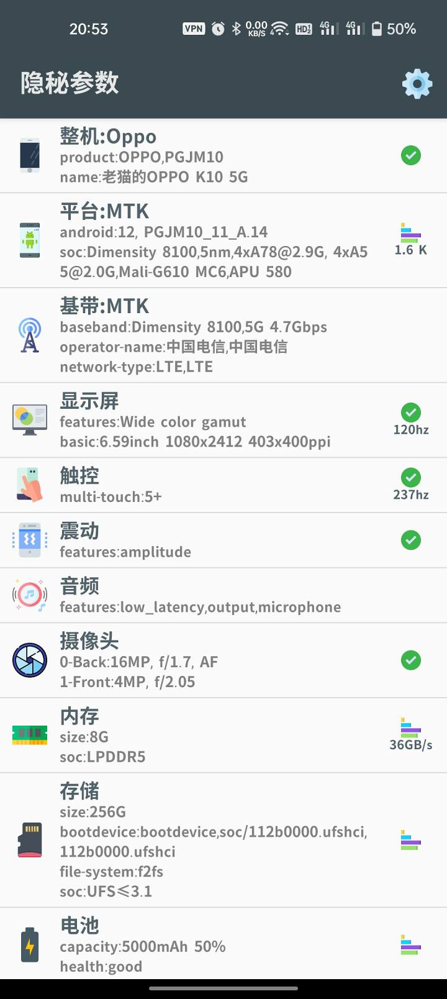

app：隐秘参数

这个最重要的就是测试手机硬件，比方说屏幕方面

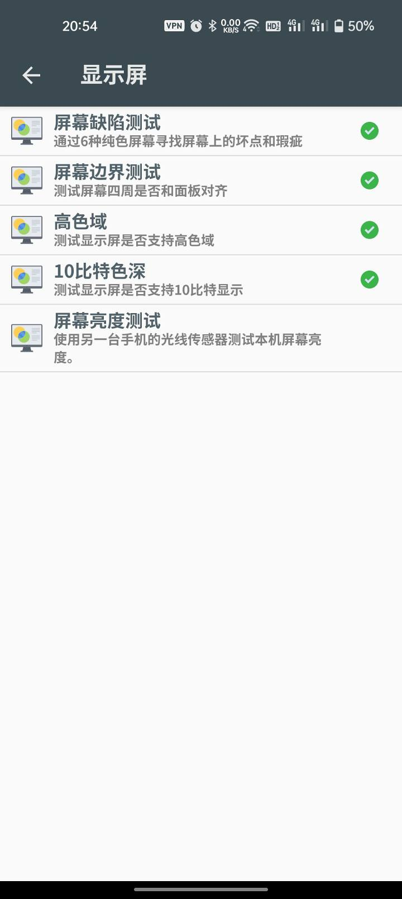

或者说按键

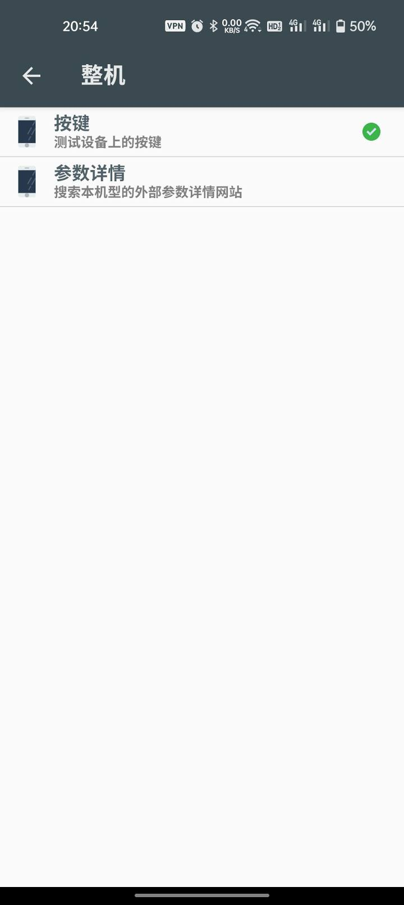

续航&充电

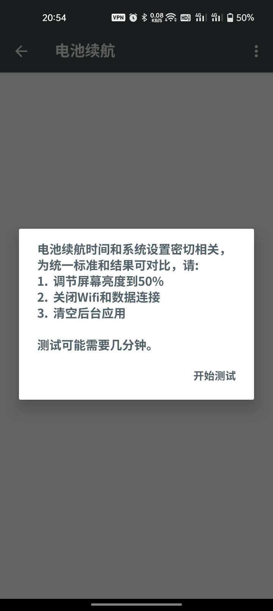

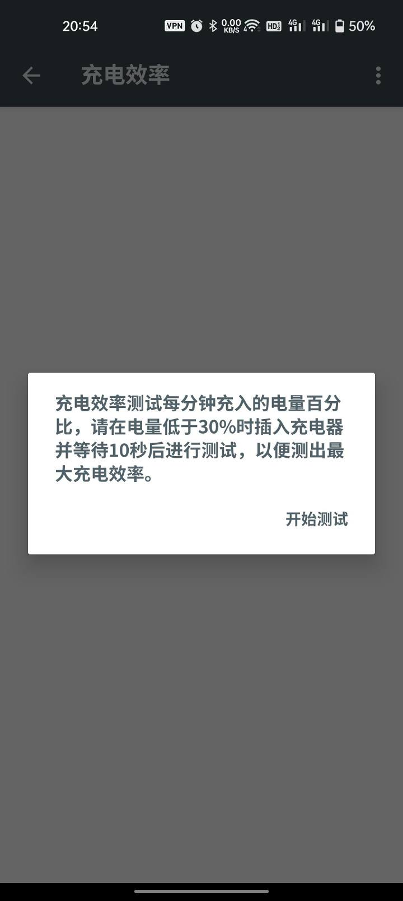

还有一些乱七八糟的

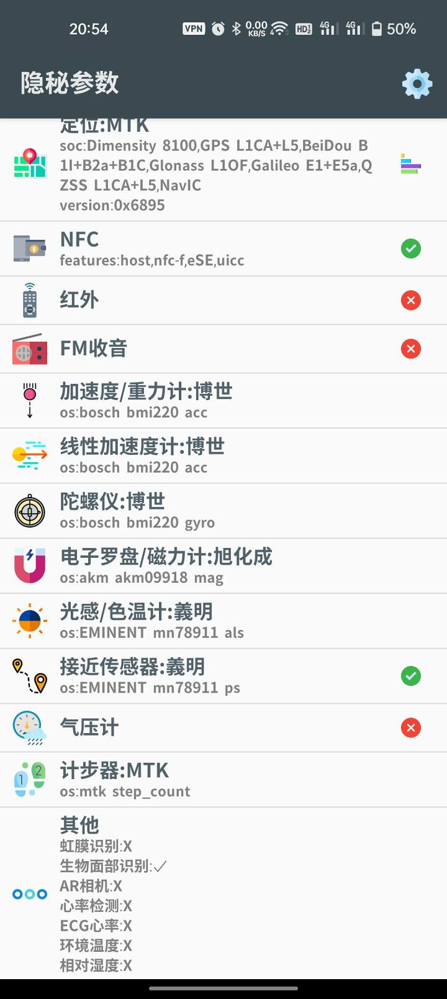

下一个就是DecvCheck Pro​

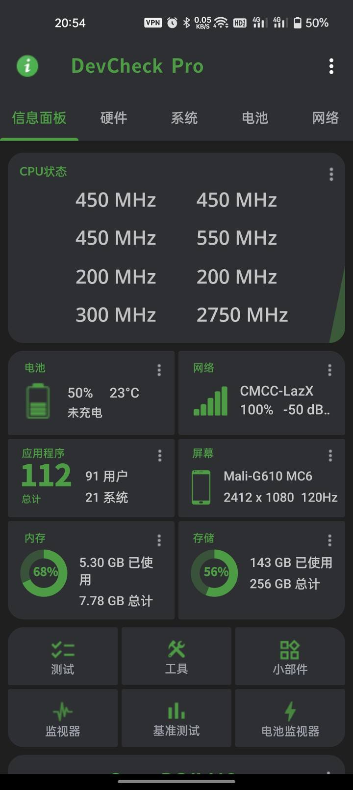

和隐蔽参数差不多，不过两个各有特色
测试

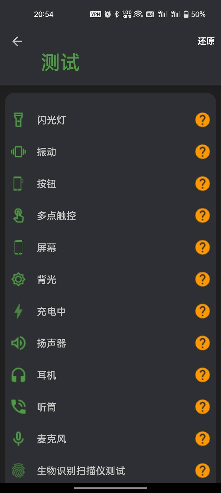

电池健康（看看就行，还是要测试续航和充电）

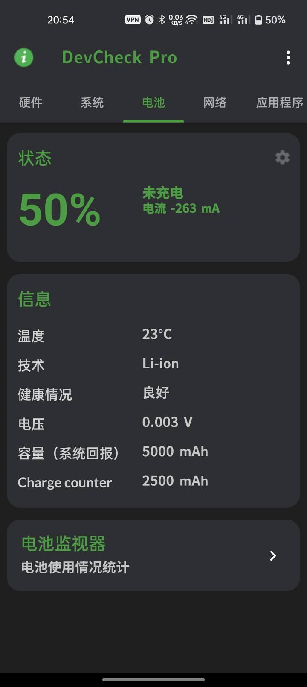

哦，还有一件事，买到东西都要全程录音录像从开箱开始，不要觉得麻烦，喏要是真的扯皮起来你就知道有多恶心了，受理都不知道什么时候能完，小二不行还得去咸鱼法庭，一扯再扯，费事

  

以上就是我，玩咸鱼的个人手段，别学我这个样子，出事了还不知道怎么解决
希望小编给个头条，让那位老哥看到

最后给大家一波小表情包，看看能不能用的上

本篇，防傻不防呆，你要是花个500块买了一个价值5000的东西，只能说你还没被骗够

427

226

362