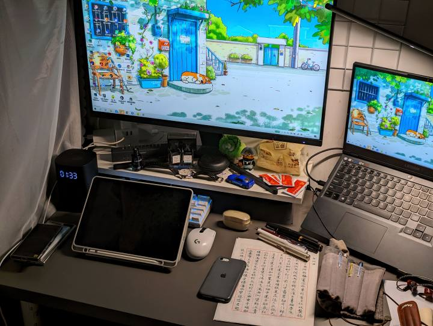
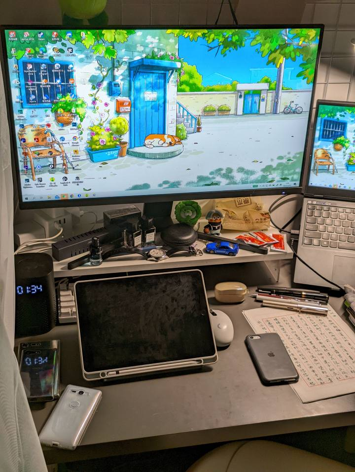
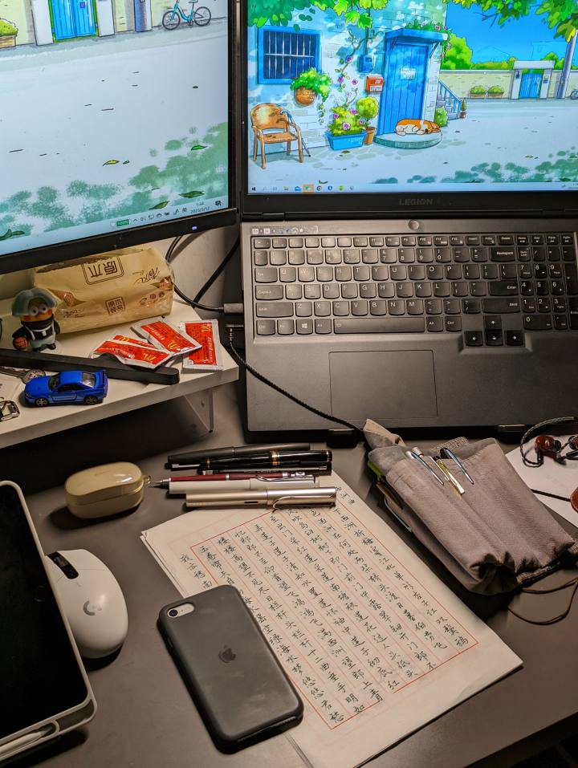
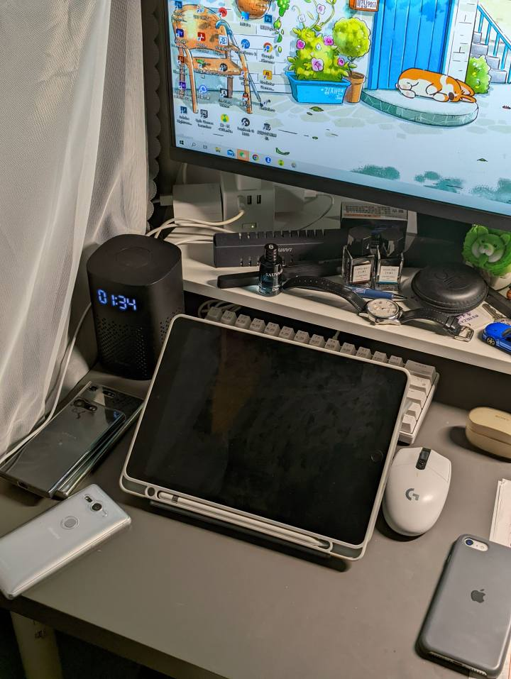

# 有时候看别人搞那种极简主义桌面... 来自 KennCYK - 酷安

KennCYK

2023-03-12 小米11 Ultra

关注

有时候看别人搞那种极简主义桌面，看的一愣一愣的。想当年为了学习极简主义还专门买了本书，认真思考了"断舍离"啥的，却发现压根不适合我这种喜欢搞这搞那，用啥就要随手就能抓来东西的人。
极简桌面虽确实高级又有质感，但现实中还是实用主义比较实在。
[#手机摄影#](https://www.coolapk.com/t/手机摄影?type=0) [#好物安利#](https://www.coolapk.com/t/好物安利?type=0)

731

749

144