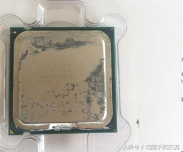
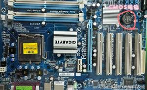
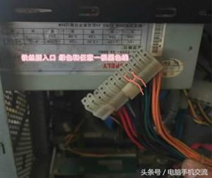
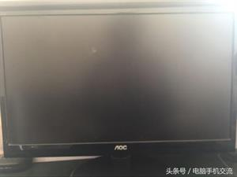

# 电脑常见故障解决，一些小毛病，不在找人
 2、电脑常见故障解决，一些小毛病，不在找人 

a

电脑常见故障解决，一些小毛病，不在找人

[鹩歌](http://www.360doc.cn/userhome.aspx?userid=1427138)  [原文来源](https://www.toutiao.com/a6472575746899444238/)

阅131转222017-11-15

[分享](http://www.360doc.cn/articleshare.html?articleid=704125036&userid=1427138&title=2、电脑常见故障解决，一些小毛病，不在找人)收藏

　　电脑手机交流 2017-10-03 14:59

日常电脑使中，总会有一些这样那样的问题。下面给大家带来一些电脑常见问题及解决方法，看完希望能帮到大家。

1、CPU CPU一般出现问题的几率非常小，一般可以排除CPU。常出现问题就是CPU风扇散热不好，导致CPU温度过高，从而电脑重启，过甚导致CPU烧毁。CPU温度过高时电脑会导致频繁关机，而且每次自动关机的时间会越来越短。

解决方法：查看CPU风扇是否正常转动或转动缓慢，如果没有请及时清理或者更换CPU风扇以及CPU上面涂抹硅胶。

2、主板 电脑有时开机屏幕没图像什么都不显示，并且没有出现报错声，考虑主板CMOS放电

，放电后电脑会自动还原。有的电脑时间不对，就算调整过后，每次开机又变回原来（也是COMS电池的问题，用的时间太长电池没电，每次关机保存不住时间）。 解决方法：找到主板上的CMOS电池，扣下来，再安回去,完成放电工作。如果是时间自动还原就直接更换电池，如果不行就的查看主板了。

3、电源 电源出现问题会出现电脑主机不通电或电脑重启关机，不通电也有可能是主板问题，一般先检查电源。

解决方法：用一根铁丝之类的东西将两头插入电源主板供电接口的绿色和黑色线接口，电源通电，看电源风扇是否转动，转的话说明电源没问题，如果风扇不转，直接更换电源。

4、显示器 现实起来一般出现花屏和黑屏，花屏很容易跟显卡的花屏搞混，黑屏的话也能跟电脑不启动搞混。

解决方法：花屏的话一般是电脑显示器链接线的问题，重新插拔一下，不行的话换个显示器试试。黑屏的话，开机看能不能听到电脑系统的开机声音，正常电脑开机会有系统声音的，如果有声音说明，显示器的问题。

以上方法自己经验，看完，希望能帮到大家。

00收藏[分享](http://www.360doc.cn/articleshare.html?articleid=704125036&userid=1427138&title=2、电脑常见故障解决，一些小毛病，不在找人)

来自：[鹩歌](http://www.360doc.cn/userhome.aspx?userid=1427138)  > 《[电脑故障](http://www.360doc.cn/userhome.aspx?userid=1427138&cid=648)》

[举报](http://www.360doc.cn/jubao.html?articleid=704125036)

猜你喜欢

类似文章

[电脑总是黑屏，里面说的超频是什么意思？](http://www.360doc.cn/article/15883912_369503467.html)[电脑黑屏问题集合](http://www.360doc.cn/article/10014713_214349158.html)[电脑黑屏故障排除实例 电脑黑屏分析](http://www.360doc.cn/article/4583281_138768381.html)[电脑黑屏现象总汇](http://www.360doc.cn/article/9943274_226717039.html)[【9个方法黑屏故障消失不见】](http://www.360doc.cn/article/11465487_274429682.html)[电脑开机故障](http://www.360doc.cn/article/10014713_219925649.html)

[更多类似文章 >>](http://www.360doc.cn/relevant.aspx?id=704125036)

生活服务

* [首页](http://www.360doc.cn/index.html)
* [社会](http://www.360doc.cn/index.html?classid=2)
* [文化](http://www.360doc.cn/index.html?classid=3)
* [人生](http://www.360doc.cn/index.html?classid=4)
* [生活](http://www.360doc.cn/index.html?classid=5)
* [健康](http://www.360doc.cn/index.html?classid=6)
* [教育](http://www.360doc.cn/index.html?classid=7)
* [职场](http://www.360doc.cn/index.html?classid=8)
* [财经](http://www.360doc.cn/index.html?classid=9)
* [娱乐](http://www.360doc.cn/index.html?classid=10)
* [艺术](http://www.360doc.cn/index.html?classid=11)
* [上网](http://www.360doc.cn/index.html?classid=12)

[留言交流](http://www.360doc.cn/advice.aspx?type=0)

回顶部

[联系我们](http://www.360doc.cn/lianxiwomen.aspx)

[触屏版](http://www.360doc.cn/index.html)| [电脑版](http://www.360doc.com/mobile)| [客户端](http://www.360doc.cn/kehuduan.aspx)

©360doc( 京ICP证090625号)

