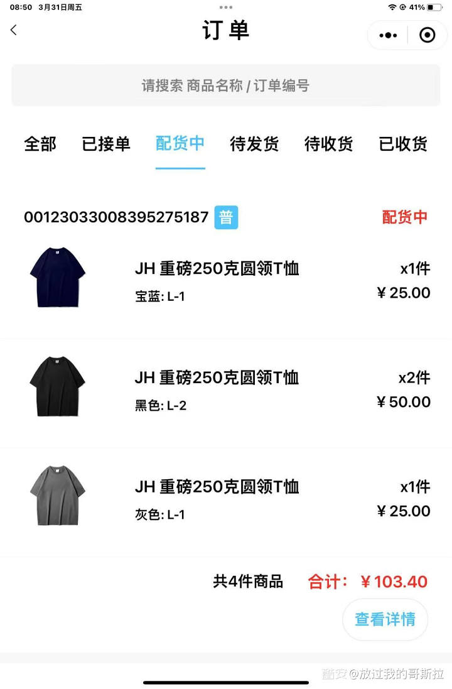
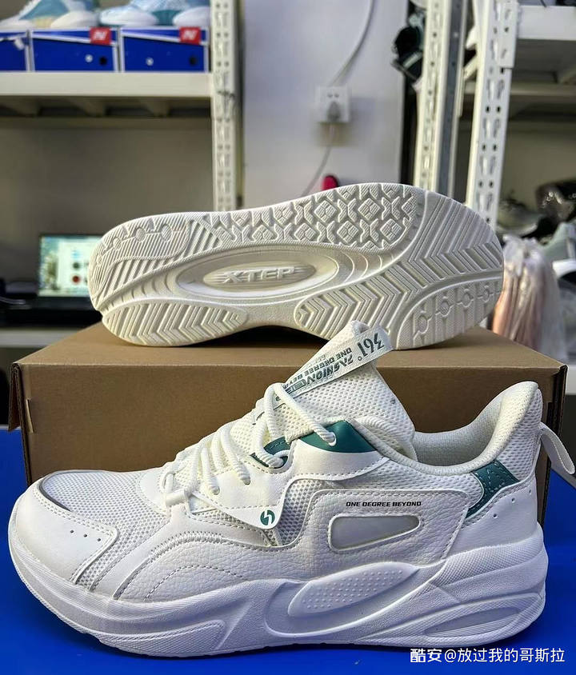
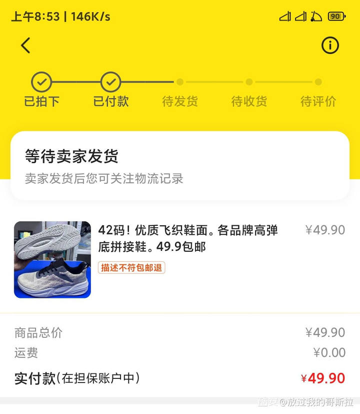
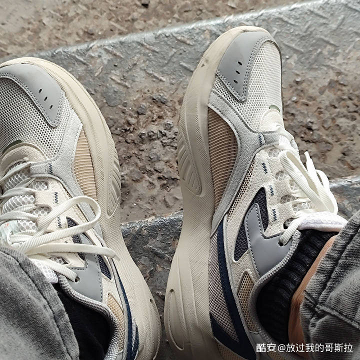
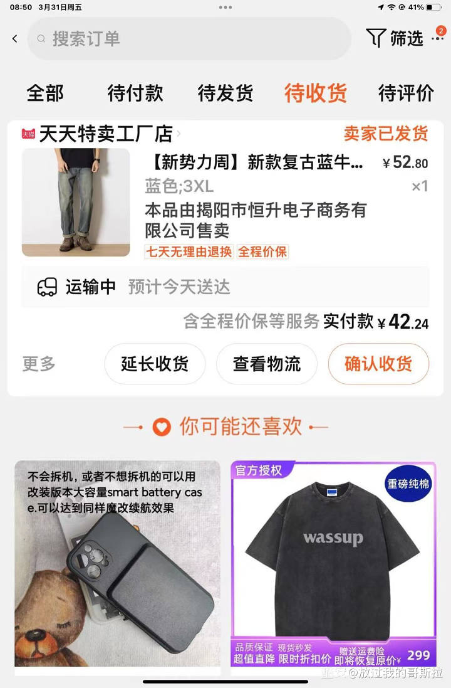
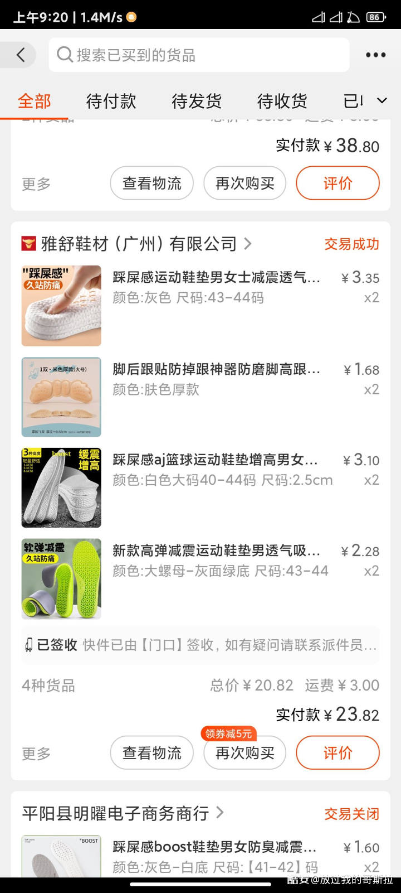

# 穷鬼穿搭，挑战全身百元级穿搭！ 来自 放过我的哥斯拉 - 酷安
[#好物安利#](https://www.coolapk.com/t/好物安利?type=12) 不求美观！舒适度绝对没问题！已经在买衣服的路上踩了很多很多坑了，现在已经稳定下来了，以后就是这样买，价格不贵，有需要的兄弟们可以尝试一下，按着这个买！

上衣，25一件，这个是衣坯，也就是纯色的t，穿了一个多月，目前没有变形，没有掉色，小领口，克重虚不虚标不知道，但是不凸点，很柔软，不死厚，之前买过230g的，价格更便宜点，比这个要厚点，可是没这件柔软，领口会变形。经过我观察…很多大牌。还有很多所谓的高品质重磅T恤，都是和这件衣服同样的领口标…

卖60-100的那种，还有牌子货，甚至质量根本就比不上这衣服。不吹了，一件20多 运费3块钱，有兴趣的老铁可以试试看，买不了吃亏买不了上当，唯一缺点就是发货有点慢，一般要2-3天左右才发货，我一次买4-5件，然后一年买一次

码数抓不准的兄弟联系买少一两次…

鞋子入手拼接鞋

咸鱼一搜很多。百元以内体验各种国产黑科技。我这双49.9元 鞋面361+鞋底特步！我特么50块钱直接穿两个大牌！还有谁

以前喜欢在淘宝的阿迪，耐克奥莱店买鞋子…经常都是一百多阿迪，两百多买耐克

后来在酷安刷到了这个拼接鞋，常买买了两双…从此再也收不住手了

国产鞋已经突破了我的认知，真的太舒服了。恕我没见过啥世面，没穿过啥好鞋子，不过这拼接鞋真的值得我吹！以前两双鞋子天天换着穿，偶尔能闻到一点点脚气，酸酸的味道

后面我买了四五双拼接鞋，轮换着穿，一点脚气都没了

有脚气的兄弟这个是技巧！再推荐一个多多买个脚气粉，一个星期用一包，基本可以根治！

裤子目前没啥推荐的，就看看最近买的牛仔裤吧

腿粗，一般都穿直筒的薄款牛仔裤，挡腿粗，淘宝买的这个裤子4天才发货，给我赔我10块钱

到手32块钱，今天能到，具体咋样还不清楚。  

总结…上衣25+裤子32+鞋子+50 +袜子2
=109元
平时不爱穿内裤

我学周董的，非常酸爽，而且牛仔裤加不穿内裤，那种feel 懂得都懂！！而且男人真滴需要这种锻炼！！以后不怕钢丝球

共计109元搞定全身穿搭，不说多好看，最起码舒适度真滴满分！

最后再推荐一下鞋垫子…一般鞋子的鞋垫都比较薄，我都会自己买鞋垫子…鞋垫子推荐买大1-2码的，因为可以修剪。我净身高180，穿点厚点的鞋垫，最主要穿鞋子舒服太多了，我是真滴喜欢软趴趴的脚底体验，踩屎感

也可以修饰一下身材的比例，看起腿会更长一点。
我是真的不舍得在穿着上面花太大的价钱

但其实在搜刮这些便宜衣服的路上也交了好多的学费，踩了很多坑。
一大早就扣好多字，好累

