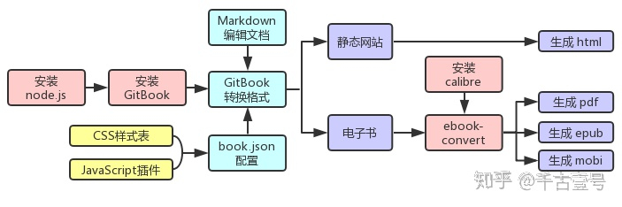

# 自己动手制作电子书的最佳方式（支持PDF、ePub、mobi等格式） - 知乎


首发于[千古壹号](http://www.zhihu.com/column/qianguyihao)

无障碍写文章

登录/注册


# 自己动手制作电子书的最佳方式（支持PDF、ePub、mobi等格式）


[千古壹号](http://www.zhihu.com/people/qianguyihao)

231 人赞同了该文章

## 前言
对于经常阅读的人来说，制作本地电子书，算是刚需了。网上的很多教程都不太好用，所以我特地整理出一个详细的教程。亲测有效，一劳永逸。

当你意外发现某个宝藏公众号时，想要集中阅读上面的每一篇文章，恨不得一口气看完，你会怎么做呢？你可能会把它添加到“微信读书”App 的书架上：


但上面这种曲线救国的方式并非最佳，仍然不尽人意，存在不少问题。

我知道，现在有很多的第三方服务，可以将任意公众号的文章制作成电子书，我试过很多次，但都是付费的。一听说要钱，你又不干了：


再列举一种场景：当你在 GitHub 上发现一个很全面很丰富的项目文档时，仿佛发现了新大陆。可 GitHub 网站的服务器在国外，国内的访问速度实在感人，你想要把它下载到本地查看，会怎么做呢？你估计会选择`git clone`或者直接选择“Download ZIP”，然后用 Typora 或者 VS Code 软件打开这个项目文档，在本地查看：


总之，你能想到的方式，我都想到了，而且都尝试过。

现在的需求就是，如果你经常阅读网上的资料，肯定会有这样一个需求：**怎么把这些几百页、甚至几千页的内容整理成 PDF、ePub、mobi等格式的电子书呢**？

要么花钱请别人做，要么自己做。

今天这篇文章，就是来告诉你”**自己动手制作 PDF、ePub、mobi 等格式电子书**“的最佳方式。如果你是码农出身，下面讲的这些步骤，根本难不倒你。如果你不是码农出身，也没关系，只要你有一台电脑，跟着我讲的教程研究下去，肯定能搞定。

问题的关键不在于难不难、会不会，而是在于你是不是**爱折腾**。

## 制作电子书的具体步骤
### 整体流程
先说一下整体步骤：

（1）安装 gitbook 工具。

（2）安装 calibre 软件，配置 `ebook-convert`工具。

（3）将`md`格式的多个文件素材导出为电子书（支持 PDF、ePub、mobi 等格式）。

（4）高级进阶：配置电子书的目录、封面、页眉页脚等。

整理流程如下：





接下来我们看看详细的完整步骤。

### 步骤 1：通过 npm 安装 gitbook-cli
安装命令如下：

```Plain Text
npm install -g gitbook-cli
```
安装成功之后，再执行`gitbook -V`命令确认是否安装成功：

```Plain Text
gitbook -V
CLI version: 2.3.2
GitBook version: 3.2.3
```
备注：如果你不知道 `npm` 是什么，可以自行查阅**如何安装 Node.js 和 npm 环境**。

### 步骤 2：安装 ebook-convert（针对 Windows 用户）
ebook-convert 是能够自由转化格式的一个命令行工具，已经包含在 calibre 软件里面了。

（1）安装 `calibre` 软件。calibre 的官网如下：（我们可以去官网下载安装）

> [https://calibre-ebook.com/](https://link.zhihu.com/?target=https%3A//calibre-ebook.com/)  

（2）在终端输入如下命令，验证 `ebook-convert` 是否能正常使用：

```Plain Text
ebook-convert --version
```
如果输入上面的命令后提示错误，说明你还需要将 calibre 的安装目录添加到系统的环境变量中。

### 步骤 2：安装 ebook-convert（针对 Mac 用户）
ebook-convert 是能够自由转化格式的一个命令行工具，已经包含在 calibre 软件里面了。

（1）安装 `calibre` 软件。calibre 的官网如下：（我们可以去官网下载安装）

> [https://calibre-ebook.com/](https://link.zhihu.com/?target=https%3A//calibre-ebook.com/)  

（2）配置 `ebook-convert`。针对 Mac 系统，需要执行如下命令，把 `ebook-convert` 软链接到 `bin` 目录：

```Plain Text
sudo ln -s /Applications/calibre.app/Contents/MacOS/ebook-convert /usr/bin
```
执行上面的命令后，如果出现`Operation not permitted`异常，说明系统权限限制，此时需要**配置环境变量**。

（3）环境变量配置：

```Plain Text
vim ~/.bash_profile

# 将下面这两行配置，添加到 .bash_profile 文件中
export EBOOK_PATH=/Applications/calibre.app/Contents/MacOS
export PATH=$PATH:$EBOOK_PATH
```
备注：可以自行研究下，在命令行环境，如何通过 vim 编辑文件。

然后刷新一下刚刚的配置：

```Plain Text
source ~/.bash_profile
```
验证`ebook-convert`是否能正常使用：

```Plain Text
ebook-convert --version
```
### 步骤 3：配置电子书的目录
本地新建一个空的文件夹，作为我们的电子书项目。文件夹的名字随便起，但建议用英文命名。

（1）项目初始化。

在当前项目下，执行如下命令，进行初始化：

```Plain Text
gitbook init
```
此时，项目下会自动生成如下两个文件：（**非常重要，必不可少**）

* `README.md`：书籍的简介放在这个文件里。  
* `SUMMARY.md`：书籍的**目录结构**在这里配置。  

这两个文件创建后，内容为空白，可使用 Markdown 语言自定义内容。

（2）配置电子书的目录。

我们先把本地的 markdown 文件（也就是我们的**电子书素材**）放到项目中，然后在`SUMMARY.md`文件中配置电子书的目录。

比如说， 我的项目中有下面这些文件：


那么，我在`SUMMARY.md`文件中就要这样配置：

```Plain Text
# 目录

* [README](./README.md)
* [00-前端工具](00-前端工具/0-README.md)
  * [01-VS Code的使用](00-前端工具/01-VS Code的使用.md)
  * [02-Git的使用](00-前端工具/02-Git的使用.md)
* [01-HTML](01-HTML/0-README.md)
  * [01-认识Web和Web标准](01-HTML/01-认识Web和Web标准.md)
  * [02-浏览器的介绍](01-HTML/02-浏览器的介绍.md)
  * [03-初识HTML](01-HTML/03-初识HTML.md)
* [02-CSS基础](02-CSS基础/0-README.md)
  * [01-CSS属性：字体属性和文本属性](02-CSS基础/01-CSS属性：字体属性和文本属性.md)
  * [02-CSS属性：背景属性](02-CSS基础/02-CSS属性：背景属性.md)
  * [03-CSS样式表和选择器](02-CSS基础/03-CSS样式表和选择器.md)
* [03-JavaScript基础](03-JavaScript基础/0-README.md)
  * [00-编程语言](03-JavaScript基础/00-编程语言.md)
  * [01-JS简介](03-JavaScript基础/01-JS简介.md)
  * [02-变量](03-JavaScript基础/02-变量.md)
  * [03-变量的数据类型：基本数据类型和引用数据类型](03-JavaScript基础/03-变量的数据类型：基本数据类型和引用数据类型.md)
```
制作成的目录，将会是下面这种效果：


### 步骤 4：导出电子书
（1）本地预览电子书：

```Plain Text
gitbook serve
```
执行上方命令后，工具会对项目里的 Markdown 格式的文件进行转换，默认转换为 html 格式，最后提示 `Serving book on http://localhost:4000`。

我们打开浏览器输入`http://localhost:4000`，预览一下电子书的效果：


（2）制作并导出电子书。**接下来就是见证奇迹的时刻**。

生成 PDF 格式的电子书：（PDF 是最常见的文档格式）

```Plain Text
gitbook pdf ./ ./mybook.pdf
```
生成 epub 格式的电子书：（epub 是最常见、最通用的电子书格式）

```Plain Text
gitbook epub ./ ./mybook.epub
```
生成 mobi 格式的电子书：（mobi 格式可以在 kindle 中打开）

```Plain Text
gitbook mobi ./ ./mybook.mobi
```
上面这三种格式的电子书生成之后，项目里会看到这三个新增的文件：


我们把电子书打开，验收一下成果。

打开 pdf 电子书看看效果：


打开 epub 电子书看看效果：


怎么样，自制电子书就这样做好了，是不是很有成就感？

## 制作电子书的高级配置
电子书做好之后，我猜你肯定想进一步做**个性化配置**，比如：怎么加封面？怎么修改页眉页脚？还有其他的一些配置。

我们来看看亲手制作的电子书，有哪些常见的高级配置。

### 制作书籍封面
为了让书籍显示得更加优雅，我们可以指定一个自定义的封面。操作如下：

在项目的根目录下准备好 `cover.jpg` （大封面）和 `cover_small.jpg` （小封面）这两种封面图片。注意，图片的文件名和后缀名必须严格按照这句话来。

GitBook 的官方文档建议： `cover.jpg` （大封面）的尺寸为 1800x2360 像素，`cover_small.jpg`（小封面）的尺寸为 200x262 像素。图片的制作，建议遵循如下规范：

* 没有边框
* 清晰可见的书本标题
* 任何重要的文字在小封面中应该清晰可见

### book.json ：电子书的各种配置
我们可以在项目的根目录下新建一个文件`book.json`（注意，文件名是`book`，后缀名是`json`），这个`book.json`就是电子书的配置文件，可以在里面填一些常见的配置。

关于 book.json 的配置项有很多，我们可以在网上搜索“GitBook book.json”找到。这里大致列举一些。

1、**常规配置**如下：


配置 book.json 的示例如下：

```Plain Text
{
    "title": "前端入门和进阶图文教程",
    "description": "前端入门到进阶图文教程，超详细的Web前端学习笔记。从零开始学前端，做一名精致优雅的前端工程师。公众号「千古壹号」作者。",
    "author": "千古壹号",
    "language": "zh-hans",
    "gitbook": "3.2.3",
    "root": "."
}
```
备注：上面的`root`根目录为当前目录，使用默认的就好，此项可以删掉，这里仅做演示。

2、**pdf** 的配置如下：（使用 `book.json` 中的一组选项来定制 PDF 输出）

| 配置项 | 描述 | | ----------------- | ------------------------------------------------------------ | | pdf.pageNumbers | 将页码添加到每个页面的底部（默认为 true） | | pdf.fontSize | 基本字体大小（默认是 12） | | pdf.fontFamily | 基本字体样式（默认是 Arial） | | pdf.paperSize | 页面尺寸，选项有： a0、a1、 a2、 a3、a4、a5、a6、b0、b1、b2、b3、b4、b5、b6、legal、letter （默认值是 a4） | | pdf.margin.top | 上边距（默认值是 56） | | pdf.margin.bottom | 下边距（默认值是 56） | | pdf.margin.left | 左边距（默认值是 62） | | pdf.margin.right | 右边距（默认值是 62） |

定制 PDF 文档输出格式的示例代码如下：

```Plain Text
{
    "pdf": {
        "pageNumbers": false,
        "fontSize": 12,
        "paperSize": "a4",
        "margin": {
            "top": 36,
            "bottom": 36,
            "left": 62,
            "right": 62
        }
    }
}
```
备注：如果你不需要对输出的 pdf 做任何特定的配置，则不需要添加上面的内容，让 pdf 的输出格式保持默认就好。

3、**plugins** 插件：

插件及其配置在 `book.json` 中指定，让电子书的配置能力更加强大。

通过插件，我们可以做很多事情，比如：修改页眉页脚、自动生成并显示图片的标题等。

另外，针对**在线版**的GitBook电子书，也有很多插件，这里列举几个：

* 自带的search插件不支持中文搜索，使用起来非常不方便，还好`search-pro`插件横空出世，让搜索功能焕发出新的生机。插件地址：[https://github.com/gitbook-plugins/gitbook-plugin-search-pro](https://link.zhihu.com/?target=https%3A//github.com/gitbook-plugins/gitbook-plugin-search-pro)
* 默认侧边栏宽度是不能够调节的，如果想通过拖拽的方式自由调节侧边栏宽度，可以使用插件`splitter`。插件地址：[https://github.com/yoshidax/gitbook-plugin-splitter](https://link.zhihu.com/?target=https%3A//github.com/yoshidax/gitbook-plugin-splitter)
* donate插件支持定义和显示支付宝和微信打赏。插件地址：[http://github.com/willin/gitbook-plugin-donate](https://link.zhihu.com/?target=http%3A//github.com/willin/gitbook-plugin-donate)

关于插件的具体配置，感兴趣的同学可以自行研究下。

### 自动生成目录（重要）
如果你的电子书素材里有很多 markdown 文件，那么，如何将多个 markdown 文件的文件名，在`SUMMARY.md`里快速生成对应的目录？

难道要一个一个地手动 copy 吗？这不可能。

说白了，这个需求就是：**如何自动生成电子书的目录**？改变世界的程序员用「脚本」就能搞定，一键执行。

网上有很多好用的脚本，我给你推荐一个亲测好用的脚本：

> GitBook 自动生成目录的脚本：[https://github.com/fushenghua/gitbook-plugin-summary](https://link.zhihu.com/?target=https%3A//github.com/fushenghua/gitbook-plugin-summary)  

操作方法很简单，把上面这个链接中的项目下载下来，进入到这个项目的目录，执行 `$ python gitbook-plugin-summary.py dirPath` 即可自动生成电子书的目录，亲测有效。备注：这里的`dirPath`指的是你的电子书目录的绝对路径。

对了，在执行上面这个脚本之前，记得先安装 `Python` 环境。

## 电子书用什么软件打开
### 用什么软件打开 PDF
Windows 平台：可以用「福昕阅读器」或者「Acrobat Reader DC」。「福昕阅读器」既有 Windows 平台，也有 Mac 平台。

Mac 平台：可以用自带的「预览」打开。

其实，不管你用的是 Windows 电脑还是 Mac 电脑，你都可以用 Chrome 浏览器打开 PDF。

iPhone 或 iPad平台：可以用自带的「iBooks」打开，或者用「WPS Office」打开。也可以用第三方软件「GoodReader」，不过需要 40 人民币。

Android 手机：可以用「WPS Office」等第三方办公软件打开。

### 用什么软件阅读 ePub 电子书
Windows 平台：可以用「calibre」软件阅读 epub 电子书。

Mac & iPhone & iPad 平台：用自带的「iBooks」阅读即可。iBooks 可以非常方便地对电子书进行标注和搜索，无疑是体验最好的 ePub 电子书阅读软件。

Android 手机：可以用「多看阅读」App 来阅读 epub 格式电子书。

### 用什么方式阅读 mobi 电子书
kindle 电子书有两种常见的电子书格式：「mobi」格式和「azw3」格式。

* 针对 mobi 格式的电子书，你既可以通过邮件的形式将其发送到 kindle 阅读器（可以自行网上查一下相关教程），也可以将其拷贝到 kindle 阅读器（是连接 usb 进行拷贝）。  
* 针对 azw3 格式的电子书，就只能通过拷贝的形式（是连接 usb 拷贝）传输到 kindle 阅读器。  

### 小结
我在 2017 年 1 月写过一篇电子书科普的文章，快三年过去了，如今回过头来看，那篇文章一点也不过时，不妨看看：《[电子书有哪些常见格式？以及该怎样阅读它](https://link.zhihu.com/?target=https%3A//mp.weixin.qq.com/s/-FsT_GQtBQ0-q_ndO5X6sQ)》

## 最后一段
如果你一时半会儿找不到可用的素材来制作电子书，可以拿我的项目练练手。项目地址：

> [https://github.com/qianguyihao/web](https://link.zhihu.com/?target=https%3A//github.com/qianguyihao/web)

不瞒你说，这篇文章，我在一年多以前就写好了初稿并放在了 GitHub 上，当时专门折腾过一次。

最近几天，我突然又有了制作电子书的需求。一年多过去了，我还以为有啥新的方法可以试试，然而我在网上找了一圈，好用的方法还是没变。所以，我今天整理一下发出来，希望让更多人看到。

其他的各种自制电子书的方法我都试过了，都不太好使，唯独 **GitBook + calibre** 是最佳选择，信我没错！

## 参考链接
* GITBOOK 使用：[https://kuang.netlify.app/blog/gitbook.html](https://link.zhihu.com/?target=https%3A//kuang.netlify.app/blog/gitbook.html)  
* GitBook 制作 Kindle 电子书详细教程：[https://github.com/fushenghua/gitbook-plugin-summary/blob/master/gitbook-guide.md](https://link.zhihu.com/?target=https%3A//github.com/fushenghua/gitbook-plugin-summary/blob/master/gitbook-guide.md)  
* gitbook-plugin-summary 工具（自动生成目录）：[https://github.com/fushenghua/gitbook-plugin-summary](https://link.zhihu.com/?target=https%3A//github.com/fushenghua/gitbook-plugin-summary)
* gitbook-plugin-atoc（自动生成目录的插件）：[https://github.com/willin/gitbook-plugin-atoc](https://link.zhihu.com/?target=https%3A//github.com/willin/gitbook-plugin-atoc)
* 自动生成目录：[https://github.com/mofhu/GitBook-auto-summary](https://link.zhihu.com/?target=https%3A//github.com/mofhu/GitBook-auto-summary)
* 使用 Gitbook 打造你的电子书：[https://juejin.im/post/6844903793033740302](https://link.zhihu.com/?target=https%3A//juejin.im/post/6844903793033740302)
* 书籍《了不起的 Markdown》的第 8 章：自由地写作——GitBook
* gitbook 的 book.json 配置示例：[https://blog.ujwd.cn/archives/349](https://link.zhihu.com/?target=https%3A//blog.ujwd.cn/archives/349)
* 关于更加详细的 book.json 文件配置：[https://zhousiwei.gitee.io/mybook/notes/gitbook\_config.html](https://link.zhihu.com/?target=https%3A//zhousiwei.gitee.io/mybook/notes/gitbook_config.html)  
* GitBook 简明使用教程：[https://www.phpjieshuo.com/archives/153/](https://link.zhihu.com/?target=https%3A//www.phpjieshuo.com/archives/153/)  
* gitbook 入门教程之导出电子书：[https://juejin.im/post/5caa0fb46fb9a05e5a2e53b3](https://link.zhihu.com/?target=https%3A//juejin.im/post/5caa0fb46fb9a05e5a2e53b3)  
* GitBook 插件整理 - book.json 配置：[https://www.cnblogs.com/mingyue5826/p/10307051.html](https://link.zhihu.com/?target=https%3A//www.cnblogs.com/mingyue5826/p/10307051.html)  
* 如何把 Markdown 文件批量转换为 PDF（不好用）：[https://sspai.com/post/47110](https://link.zhihu.com/?target=https%3A//sspai.com/post/47110)  

发布于 2020-09-15 17:40

[电子书](http://www.zhihu.com/topic/19552449)

[Calibre](http://www.zhihu.com/topic/19612216)

[ePub](http://www.zhihu.com/topic/19554613)

​赞同 231​​23 条评论

​分享

​喜欢​收藏​申请转载

​

写下你的评论...


23 条评论

默认

最新


[疯猹学狗叫](https://www.zhihu.com/people/abe8489069f3e01b0bf27c35026479fc)

好家伙，本来想找点干货的，结果差点干死我


02-22

​7


[浮生如梦](https://www.zhihu.com/people/4118e1ba7c0b20ad3b3aa76a2bca7a77)


噎着了，我也是，但是我想吐出来再嚼嚼

05-26

​1


[balabala](https://www.zhihu.com/people/4c28f25fb163cd4a73b771a5df60bd01)

看不懂

2020-10-10

​6


[与生活斗其乐无穷](https://www.zhihu.com/people/0c8f6f45daab989fd4feadbfcf696bc5)

对我们小白来说有点难哦

2021-02-03

​4


[shawujing](https://www.zhihu.com/people/2ad99c3946f6ef7fe8188f3ca81d1926)

折腾了一会儿，碰到一些问题，还是搞定了，谢谢楼主！不过后来发现Kindle直接读word也挺好

2021-04-01

​3


[小光shawn](https://www.zhihu.com/people/0de54a9f6dc84a3e80759c9a6b7ec33d)

谢谢提醒，查了一下，支持word 就避免折腾了。

2021-06-19

​赞


[张晓峰](https://www.zhihu.com/people/69ea89633e921a5e6029c584c4fed24a)

如果直接用calibre能不能制作电子书？为啥需要gitbook呢？还是没太明白

06-20

​1


[简单的一分为二](https://www.zhihu.com/people/45490354715b459caf1eab8669eabae5)

感谢分享，感觉很复杂，一看头就大

2021-11-08

​赞


[谢克成](https://www.zhihu.com/people/48f91d6cdc85dd767434ecfc123cfe2b)

感谢分享，使用 node16版本安装gitbook-cli 可以有些文件丢失，换node 10.14.1 版本可以解决

2021-09-10

​赞


[马力](https://www.zhihu.com/people/7cb71a14ffd59bcd621fb925d4103aa2)

感谢

09-06

​赞


[慢鱼](https://www.zhihu.com/people/2fef74b1766a70cc2ed9d7624ee65229)

gitbook转pdf后，菜单不能跳转对应页面，大佬是怎么解决的

2021-07-19

​赞


[TNT](https://www.zhihu.com/people/1ba09a946c3e7692f03503bef0a3a9f9)

写电子书最好用的是sigil

2021-04-02

​赞


[随缘](https://www.zhihu.com/people/a444fddcaf5f0806764ae95d9c261e10)

手机制作的话怎么操作

2021-02-08

​赞


[悟空](https://www.zhihu.com/people/1f98af8f3b732d0a071b6c5e52cc1aab)

"options" property is deprecated, use config.get(key) instead

2021-02-01

​赞


[公子扬](https://www.zhihu.com/people/af011fdf5bb27188f16ba315ba6677c5)

目前做电子书没有一个比得上indesign的（仅限于2019版本之前）

2021-01-07

​赞


[Ming Aaron](https://www.zhihu.com/people/c22b94fac7f16f8c0e4f96d015502b4d)

看不懂，想问一下比起直接用calibre转换pdf为mobi格式优势在哪？

2021-01-07

​赞


[流浪的darcy](https://www.zhihu.com/people/6f77e0cbd3b31df7d1e0058373a67ead)


如果你没有相应的需求，这样确实是最快的选择。选择这个的原因主要是，你所要阅读的对象的很可能不是“一本书”，而是四散在文件夹里四处交叉引用的很多文件，而calibre是没有这样的能力的


2021-03-05

​2


[滚滚饭](https://www.zhihu.com/people/520af19ba4e615dfe332d61558f27ff2)

暂时还没折腾，谢谢大佬

2020-12-15

​赞


[天下第一大帅鹏](https://www.zhihu.com/people/b433a97143a460d690f13312c7e3d3bd)


关注咯还等什么


2020-10-20

​赞


[无书](https://www.zhihu.com/people/f139f5954777079018f0c17f9d5f4201)

感谢分享

2020-10-14

​赞


[无法无天](https://www.zhihu.com/people/3fb98d10622bd7036832ce37333173b9)

按照这个方法走到了最后一步，卡住了。只有几个素材时就可以，多了，就不行，晕！

05-25

​赞


[技术和人](https://www.zhihu.com/people/4759e9241cbf9f00d29c5d823455e8ef)


你这个是真的厉害

04-16

​赞


[秋月枫临](https://www.zhihu.com/people/6c7968b4bdea8783451c8de623c67814)

太棒了


02-08

​赞

写下你的评论...


### 文章被以下专栏收录


## [千古壹号](http://www.zhihu.com/column/qianguyihao)
分享可操作性强的知识和技能。

### 推荐阅读
[你不知道的两个超级好用的电子书工具！==================今天来讲讲电子书的事儿。 关于电子书的搜索网站，老Y在之前的文章中推荐了不少，稍微总结下： 推荐6个电子书神站+1个电子书管理神器！ 这份资源绝对值得收藏和学习！豆瓣读书TOP250电子书 …老Y工作室发表于老Y工作室](https://zhuanlan.zhihu.com/p/188720610)


[【干货篇】电子书的最强制作攻略，上手超简单！======================云展网](https://zhuanlan.zhihu.com/p/371069335)


[最强大的本地电子书管理工具calibre====================坚果云](https://zhuanlan.zhihu.com/p/60519938)


[电子书：格式、资源和DRM脱壳===============Eleve...发表于Eikip...](https://zhuanlan.zhihu.com/p/356716143)


登录即可查看 超5亿 专业优质内容

超 5 千万创作者的优质提问、专业回答、深度文章和精彩视频尽在知乎。

立即登录/注册